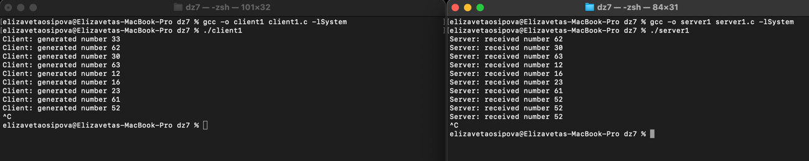
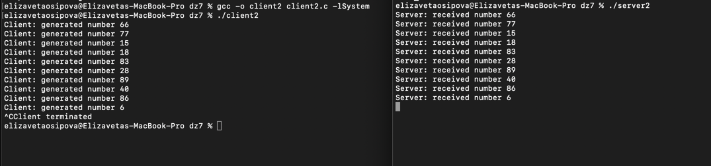
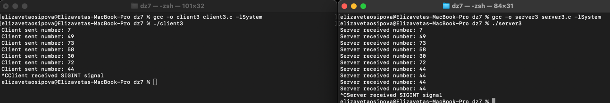

## Домашнее задание №7

### Осипова Елизавета Владимировна - БПИ-219

### Задание

Разработать программы клиента и сервера, взаимодействующих
через разделяемую память с использованием функций POSIX.
Клиент генерирует случайные числа в том же диапазоне, что и
ранее рассмотренный пример. Сервер осуществляет их вывод.

Необходимо обеспечить корректное завершение работы для
одного клиента и сервера, при котором удаляется сегмент
разделяемой памяти.

### Отчет

```
gcc -o server server.c -lSyste
gcc -o client3 client3.c -lSystem

./client
./server
```

Сервер - [server1.c](server1.c)

Клиент - [client1.c](client1.c)



Дополнительно реализованы следующие варианты завершения работы:

1) Использование сигналов. <br>
В данной реализации был использован способ завершения программы с помощью сигнала SIGINT. Когда пользователь вводит комбинацию клавиш Ctrl + C, операционная система посылает сигнал SIGINT всем процессам в текущей группе процессов, включая наш клиентский процесс.

Мы устанавливаем обработчик этого сигнала с помощью функции signal и указываем функцию-обработчик sig_handler. В данном случае, когда приходит сигнал SIGINT, программа меняет значение переменной exit_flag на 1, что приводит к завершению бесконечного цикла записи данных в разделяемую память и завершению программы.

После завершения работы клиента, мы удаляем сегмент разделяемой памяти из адресного пространства процесса с помощью функции munmap.

Сервер - [server2.c](server2.c)

Клиент - [client2.c](client2.c)



2) Использование флагов. <br>
В программе можно использовать флаги, которые показывают, когда программа должна завершить работу. Например, можно использовать глобальный флаг exit_flag, который устанавливается в значение 1, когда программа должна завершить работу. В основном цикле программы можно проверять значение этого флага и выходить из цикла, если флаг установлен. Когда программа выходит из цикла, она должна выполнить завершающие операции и освободить ресурсы.

Сервер - [server3.c](server3.c)

Клиент - [client3.c](client3.c)



